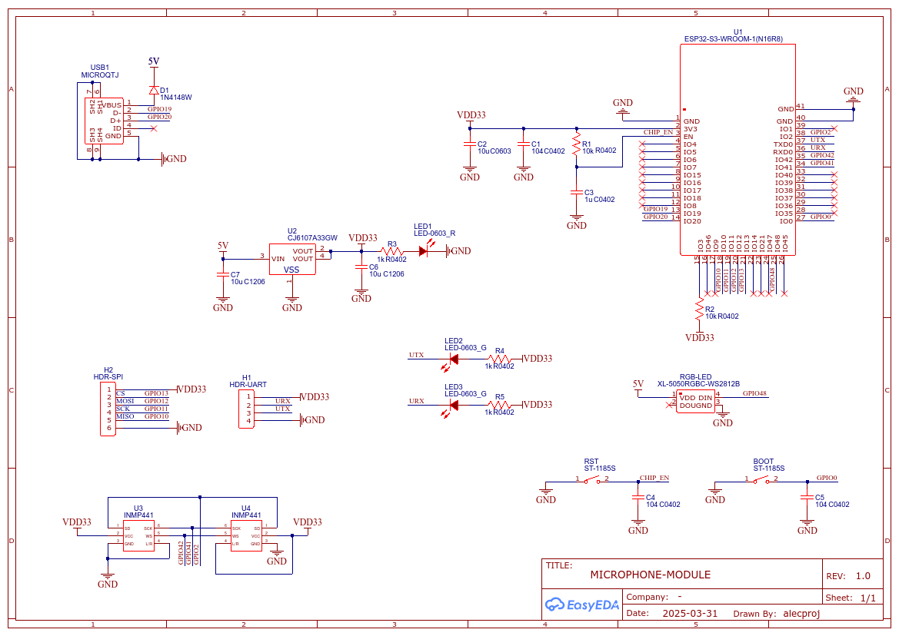

# Smart Home Microphone Module
English | [Русский](./README.ru.md)

**Smart Home Microphone Module** is a compact IoT device based on the ESP32-S3 microcontroller, designed for use in voice-controlled systems, audio monitoring, and integration with smart-home infrastructure. The device captures ambient sound, isolates voice data, processes it, and transmits it over a distributed network.

> [!NOTE]  
> This project is based on the [voice_activity_detection](https://github.com/espressif/esp-skainet/tree/master/examples/voice_activity_detection) example from Espressif’s esp-skainet repository.

# Overview

The project comprises the following components:
- [Microphone Module](#microphone-module) (source code, schematic, PCB layout, enclosure)
- [Server](#server) (server-side source code)
- [voice_activity_detection Example](#voice_activity_detection-example) from Espressif, adapted for DevKit ESP32-S3 with one or two INMP441 MEMS microphones

## Microphone Module

 
The core components of the device are the `ESP32-S3-WROOM-N16R8` module and two I²S MEMS microphones `INMP441`.

> [!WARNING]  
> This project works **only** with an ESP32 variant that supports **at least 4 MB of PSRAM**!

The module reads audio data from the I²S microphones and processes it using Espressif’s **Audio Front End ([AFE](https://docs.espressif.com/projects/esp-sr/en/latest/esp32s3/audio_front_end/README.html))**. During processing, it performs **Voice Activity Detection (VAD)** and **Noise Suppression (NS)**. The voice data then undergoes **Automatic Gain Control (AGC)**, is converted to mono, packaged into **RTP packets**, and sent to the server over Wi-Fi via **UDP**.

Schematic of AFE audio processing:  

The project also includes a server application that runs on the local network and performs **speech recognition**.

Key features of the device:
-  Audio processing: VAD / NS / AGC / MISO
-  Logging processed voice data to an SD card (for debugging)
-  Transmitting only voice-active raw PCM data over Wi-Fi (UDP/RTP)

> [!TIP]  
> You can easily reproduce this on a breadboard and test it yourself.  
> Check the [module/](./module) directory for the microphone module’s source code and its **README** with quick-start setup instructions.

### Schematic

> [!CAUTION]  
> There may be errors in the schematic or PCB layout. Before fabricating the PCB, we recommend consulting a professional!  
> See the [implementation notes](./pcb/README.md).

### Enclosure

## Server

The **server application**, written in Python, receives RTP packets from the device over the local network. Depending on user configuration, it can:
- play back the incoming audio in real time,
- save it to a file,
- perform offline speech recognition using the [VOSK API](https://github.com/alphacep/vosk-api) framework.

> [!TIP]  
> See the [server/](./server) directory for the server application’s source code and its **README** with quick-start setup instructions.

## voice_activity_detection example

The original **VAD** example from Espressif’s [esp-skainet](https://github.com/espressif/esp-skainet) repository supports only official evaluation boards (Korvo, Eye, etc.). In this project, it has been extended to run on **custom boards** (including the ESP32 DevKit) with one or two **INMP441** microphones (or other I²S MEMS mics).

> [!TIP]  
> See the [examples/voice_activity_detection](./examples/voice_activity_detection) directory for the example’s description, source code, and its **README** with quick-start setup instructions.
