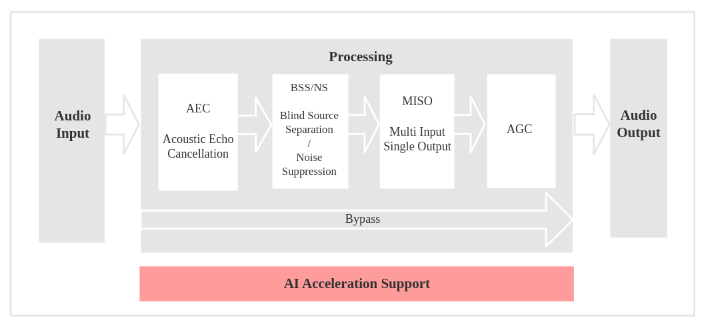

  
# Микрофонный модуль умного дома
[English](./README.md) | Русский

**Микрофонный модуль умного дома** — это компактное IoT-устройство на базе микроконтроллера ESP32-S3, предназначенное для использования в системах голосового управления, аудиомониторинга и интеграции с инфраструктурой «умного дома». Устройство выполняет захват звука в помещении, выделяет голосовые данные, обрабатывает их и передаёт по распределённой сети.

>[!NOTE]
Проект основан на примере [voice_activity_detection](https://github.com/espressif/esp-skainet/tree/master/examples/voice_activity_detection) из репозитория esp-skainet от Espressif.
# Обзор

Проект состоит из следующих компонентов:
- [Микрофонный модуль](#микрофонный-модуль) (исходный код, схема, разводка платы, корпус)
- [Исходный код серверной части](#сервер)
- [Пример voice_activity_detection](#пример-voice_activity_detection) от Espressif, адаптированный для работы с DevKit ESP32-S3 и одним или двумя MEMS-микрофонами **INMP441**

## Микрофонный модуль

Основными компонентами устройства являются модуль `ESP32-S3-WROOM-N16R8` и два I²S MEMS-микрофона `INMP441`.

> [!WARNING]  
> Проект работает **только** с ESP32, поддерживающим **не менее 4 МБ PSRAM**!

Модуль считывает аудиоданные с I²S-микрофонов и обрабатывает их с использованием **акустического фронтенда ([AFE](https://docs.espressif.com/projects/esp-sr/en/latest/esp32s3/audio_front_end/README.html))** от Espressif. В процессе обработки выполняется **обнаружение речи** (Voice Activity Detection, VAD) и **подавление шумов** (Noise Suppression, NS). Далее голосовые данные проходят **автоматическую регулировку усиления** (Auto Gain Control, AGC), конвертируются в моно, упаковываются в **RTP-пакеты** и передаются на сервер по Wi-Fi через **UDP**.

**Схема обработки звука (AFE):**

В проект также входит серверное приложение, работающее в локальной сети и выполняющее **распознавание речи**.

Ключевые функции устройства:
- Обработка звука: VAD / NS / AGC / MISO
- Запись обработанных голосовых данных на SD-карту (для отладки)
- Передача только голосовых данных в формате **raw PCM** по Wi-Fi (UDP/RTP)

>[!TIP]  
Проект легко воспроизвести на макетной плате и протестировать самостоятельно.  
Ознакомьтесь с содержимым директории [module/](./module) — в ней находится исходный код микрофонного модуля и файл **README** с инструкцией по быстрой установке.

### Схема

> [!CAUTION]
> Схема и разводка печатной платы могут содержать ошибки. Перед воспроизведением печатной платы рекомендуется проконсультироваться с профессионалом!
> Ознакомьтесь с [заметками о реализации](./pcb/README.ru.md)!

### Корпус

## Сервер

**Серверное приложение**, написанное на Python, принимает RTP-пакеты от устройства по локальной сети. В зависимости от настроек пользователя, оно может:
- воспроизводить полученные аудиоданные в реальном времени,
- сохранять их в файл,
- выполнять офлайн-распознавание речи с помощью фреймворка [VOSK API](https://github.com/alphacep/vosk-api).

>[!TIP]
>Ознакомьтесь с содержимым директории [server/](./server) — в ней находится исходный код серверного приложения и файл **README** с инструкцией по быстрой установке.

## Пример voice_activity_detection

Исходный пример использования технологии **VAD** из репозитория [esp-skainet](https://github.com/espressif/esp-skainet) компании Espressif поддерживает только фирменные отладочные платы (Korovo, Eye и т.д.). В рамках данного проекта была добавлена возможность запуска этого примера на **кастомных платах** (включая DevKit ESP32) с одним или двумя микрофонами **INMP441** (или другие I²S MEMS-микрофоны).
>[!TIP]
>Ознакомьтесь с содержимым директории [examples/voice_activity_detection](./examples/voice_activity_detection) — в ней находится описание примера, исходный код и файл **README** с инструкцией по быстрой установке.
