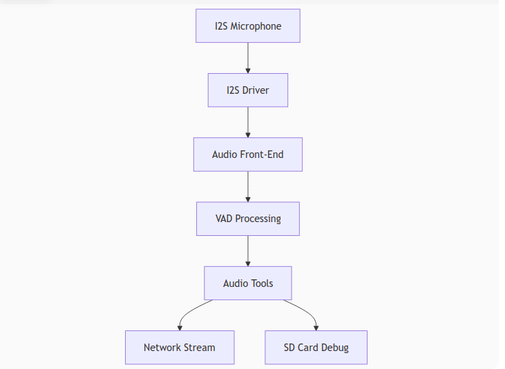
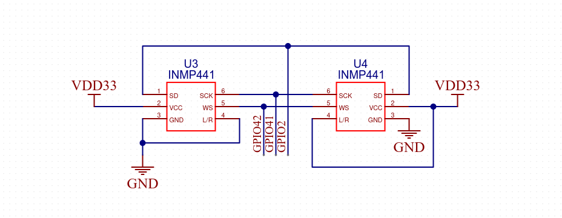

<div align="center">

# Module Firmware
English | [Русский](./README.ru.md)
</div>

# Overview

This section covers the ESP32-S3 firmware implementing the Smart Home Microphone Module with the following functionality:
- 🎙️ Audio capture via I²S microphone (e.g., INMP441) with multi-channel input support
- 🧠 Audio processing using Espressif’s ESP-SR (Speech Recognition) library:
- 🧠 VAD (Voice Activity Detection)    
- 🌐 Audio transmission over the network using RTP and UDP protocols
- 💾 Debug logging of raw PCM data to an SD card (optional)

### Key Technologies

- [ESP-IDF](https://github.com/espressif/esp-idf) – Development framework for ESP32
- [ESP-SR](https://github.com/espressif/esp-sr) – Espressif’s audio-processing library
- [RTP](https://en.wikipedia.org/wiki/Real-time_Transport_Protocol) – Real-time audio transport protocol
- [FATFS](https://docs.espressif.com/projects/esp-idf/en/v5.4.2/esp32s3/api-reference/storage/fatfs.html) – File system for SD-card access
- [FreeRTOS](https://docs.espressif.com/projects/esp-idf/en/v5.4.2/esp32s3/api-reference/system/freertos.html) – Real-time OS for multi-core processing

### Use Cases

1. Voice-control systems with remote processing
2. Lecture-recording devices streaming to a server
3. Real-time audio-monitoring systems

### Implementation Highlights

1. Dual-core architecture:
    ```c
    xTaskCreatePinnedToCore(&feed_Task, ...);  // Core 0: capture
    xTaskCreatePinnedToCore(&fetch_Task, ...); // Core 1: processing
    ```    
2. Efficient memory management:
    - Statically allocated buffers
    - Ring buffers for audio data
    - Minimal data copying
3. Fault tolerance:
    - Packet-integrity checks
    - Automatic driver reinitialization
    - Buffer-overflow protection

### Operation Modes

1. **Direct streaming to server**  
    Module → Wi-Fi → RTP/UDP → Recognition server
2. **Local storage**  
    Module → SD Card
3. **Hybrid mode**  
    Module → (Network + SD Card) in parallel

### Firmware Architecture Diagram


# Get started

## Hardware Preparation

You will need:
- An ESP32 development board with **at least 4 MB PSRAM** (recommended **ESP32-S3-N16-R8**)
- Two **INMP441** microphones
- An SPI SD-card adapter (_optional, for debugging_)

### Microphone Connection

Wire the microphones as shown below:  


**Left microphone pinout:**

|Microphone Pin|ESP32-S3 Pin|
|---|---|
|SD|GPIO2|
|VCC|3v3|
|GND|GND|
|SCK|GPIO41|
|WS|GPIO42|
|L/R|GND|

**Right microphone pinout:**

|Microphone Pin|ESP32-S3 Pin|
|---|---|
|SD|GPIO2|
|VCC|3v3|
|GND|GND|
|SCK|GPIO41|
|WS|GPIO42|
|L/R|3v3|

> [!NOTE]  
> You can change the microphone pin assignments in [`module/i2s/i2s_input.h`](./i2s/i2s_input.h) under the `I2S interface GPIO pin assignments` section.

### SD-Card Adapter Connection

**Adapter pinout:**

|Adapter Pin|ESP32-S3 Pin|
|---|---|
|CS|GPIO13|
|SCK|GPIO11|
|MOSI|GPIO12|
|MISO|GPIO10|
|VCC|3v3|
|GND|GND|

> [!NOTE]  
> You can change the SD-card adapter pin assignments in [`module/sd_card/sdcard.h`](./sd_card/sdcard.h) under the `SD Card SPI interface configuration` section.

## Software Preparation

### Install ESP-IDF

To flash the microcontroller and configure the project, install the [ESP-IDF framework](https://docs.espressif.com/projects/esp-idf/en/v5.4.2/esp32s3/get-started/index.html) version **5.0 or newer**.

### Project Setup

1. Clone the repository:
	```sh
    git clone https://github.com/alecproj/microphone-module.git
	```
2. If you plan to use the module with your computer acting as the server on the local network, it’s recommended to first [install and configure the server](../server/README.md).
3. Change into the module directory:
    ```sh
    cd microphone-module/module
    ```
4. Set up ESP-IDF environment variables (see the [official guide](https://docs.espressif.com/projects/esp-idf/en/v5.4.2/esp32s3/get-started/linux-macos-setup.html#step-4-set-up-the-environment-variables)).
5. Configure the project:
    ```sh
    idf.py set-target esp32s3
    idf.py menuconfig
    ```
    In the **Example Connection Configuration** section, set your Wi-Fi parameters if you plan to stream to the server.
6. In [`./main/main.c`](./main/main.c), adjust the configuration switches as needed:
    ```c
    // Configuration switches
    #define SD_FOR_DEBUG_EN 0  // Enable SD card logging for debug (0=disabled)
    #define NETWORK_EN      1  // Enable network streaming (1=enabled)
    ```

> [!NOTE]  
> For logging to SD card, ensure the SPI-SD adapter is connected.

7. In [`../network/network_stream.h`](./network/network_stream.h), set your computer’s IP address:
    ```c
    #define SERVER_IP "192.168.0.175"  // Default server IP address
    ```
8. Build and flash the board:
    ```sh
    idf.py build
    idf.py flash monitor
    ```

# Troubleshooting

## Wi-Fi Connection Issues

1. Double-check your settings in the **Example Connection Configuration** menuconfig. Ensure the **WiFi scan threshold** matches your network’s parameters.
2. Make sure no metallic objects (wires, breadboards, PCB copper areas, etc.) are near the ESP32 antenna.
3. Reserve a static IP for the ESP32 in your router’s DHCP settings.
4. Run the official ESP-IDF examples [scan](https://github.com/espressif/esp-idf/tree/master/examples/wifi/scan) and [station](https://github.com/espressif/esp-idf/tree/master/examples/wifi/getting_started/station) to find the optimal module placement.

> [!NOTE]  
> Common stability issues with the ESP32’s onboard antenna stem from nearby metal objects. For robust connectivity, consider using a module with an external antenna.

## SD-Card SPI Adapter Issues

1. Verify the adapter wiring against the schematic and the settings in [`module/sd_card/sdcard.h`](./sd_card/sdcard.h) under `SD Card SPI interface configuration`.
2. Use the shortest possible wires (no longer than 10 cm).
3. Manually format the SD card as FAT32 using your OS tools.
4. Prefer SD cards up to 8 GB in capacity.
5. If issues persist, lower the SPI bus speed (see the sdspi example README in ESP-IDF: [sdspi](https://github.com/espressif/esp-idf/tree/master/examples/storage/sd_card/sdspi)).

> [!NOTE]  
> Not all SD cards support SPI mode. Check your card’s datasheet. Card-adapter compatibility can vary, so you may need to test cards from different manufacturers.
# TODO

- Add LED status indication
- Implement custom Wi-Fi connection logic
- Integrate automatic gain control (AGC)
- Add project configuration via `Kconfig`
- Implement an OTA update system
