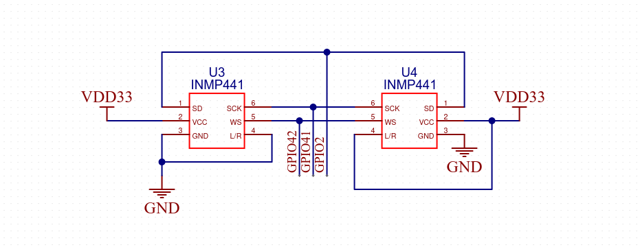

<div align="center">
  
[English](./README.md) | Русский
</div>

# Быстрый старт
## Подготовка оборудования

Вам понадобится:
- Отладочная плата с микроконтроллером **ESP32** с поддержкой **PSRAM не менее 4 МБ** (рекомендуется **ESP32-S3-N16-R8**)
- Два микрофона **INMP441**
- SPI-адаптер SD-карт (*опционально, для отладки*)
### Подключение микрофонов
Подключите микрофоны согласно приведённой ниже схеме:


**Таблица подключения левого микрофона:**

| Контакт микрофона | Контакт ESP32-S3 |
| ----------------- | ---------------- |
| SD                | GPIO2            |
| VCC               | 3v3              |
| GND               | GND              |
| SCK               | GPIO41           |
| WS                | GPIO42           |
| L/R               | GND              |

**Таблица подключения правого микрофона:**

| Контакт микрофона | Контакт ESP32-S3 |
| ----------------- | ---------------- |
| SD                | GPIO2            |
| VCC               | 3v3              |
| GND               | GND              |
| SCK               | GPIO41           |
| WS                | GPIO42           |
| L/R               | 3v3              |
>[!NOTE]
>Изменить назначение пинов микрофонов можно в файле [`module/i2s/i2s_input.h`](./i2s/i2s_input.h) в разделе `I2S interface GPIO pin assignments`.
### Подключение адаптера SD-карт
**Таблица подключения адаптера:**

| Контакт адаптера | Контакт ESP32-S3 |
| ---------------- | ---------------- |
| CS               | GPIO13           |
| SCK              | GPIO11           |
| MOSI             | GPIO12           |
| MISO             | GPIO10           |
| VCC              | 3v3              |
| GND              | GND              |
>[!NOTE]
>Изменить пины подключения SD-адаптера можно в файле [`module/sd_card/sdcard.h`](./sd_card/sdcard.h) в разделе `SD Card SPI interface configuration`
## Подготовка ПО
### Установка ESP-IDF

Для прошивки микроконтроллера и конфигурации проекта необходим установленный фреймворк [ESP-IDF](https://docs.espressif.com/projects/esp-idf/en/v5.4.2/esp32s3/get-started/index.html) версии **не ниже 5.0**.

### Подготовка проекта

1. Клонируйте репозиторий проекта:
```sh
git clone https://github.com/alecproj/microphone-module.git
```
2. Если вы хотите использовать модуль для взаимодействия с сервером, в роли которого будет выступать ваш компьютер в локальной сети, то рекомендуется сначала [установить и настроить сервер](../server/README.ru).
3. Перейдите в директорию модуля:
```sh
cd module
```
4. Настройте переменные среды ESP-IDF (см. [официальное руководство](https://docs.espressif.com/projects/esp-idf/en/v5.4.2/esp32s3/get-started/linux-macos-setup.html#step-4-set-up-the-environment-variables))
5. Выполните настройку проекта:
```sh
idf.py set-target esp32s3
idf.py menuconfig
```
В разделе `Example Connection Configuration` укажите параметры сети, если планируется подключение к серверу по Wi-Fi.
6. Перейдите в папку `./main`, откройте файл [`main.c`](./main/main.c) и настройте параметры:
```c
// Configuration switches
#define SD_FOR_DEBUG_EN 0  // Enable SD card logging for debug (0=disabled)
#define NETWORK_EN 1       // Enable network streaming (1=enabled)
```
>[!NOTE]
>Для записи на SD-карту должен быть подключён SPI-адаптер.

7. Перейдите в папку `../network`, откройте файл [`network_stream.h`](./network/network_stream.h) и укажите ip-адрес вашего компьютера:
```c
#define SERVER_IP "192.168.0.175"     // Default server IP address
```
8. Скомпилируйте проект и прошейте плату:
```sh
idf.py build
idf.py flash monitor
```
# Устранение неисправностей
## Проблемы с Wi-Fi соединением

1. Перепроверьте корректность настроек в разделе `Example Connection Configuration` menuconfig. Значения в разделе `WiFi scan threshold` должны соответствовать параметрам вашей WiFi сети.
2. Убедитесь, что рядом с антенной ESP32 нет металлических предметов (включая провода, макетные платы и другие элементы, способные экранировать сигнал).
3. Зарезервируйте статический IP-адрес для ESP32 в настройках DHCP-сервера вашего роутера.
4. Запустите официальные примеры [scan](https://github.com/espressif/esp-idf/tree/master/examples/wifi/scan) и [station](https://github.com/espressif/esp-idf/tree/master/examples/wifi/getting_started/station) из репозитория ESP-IDF и подберите оптимальное расположение модуля.

> [!NOTE]  
> Наиболее распространённые проблемы со стабильностью Wi-Fi при использовании ESP32 с интегрированной антенной связаны с экранирующими объектами рядом (макетные платы, провода, металлические полигоны). Рекомендуется использовать модули с внешней антенной для надёжного соединения.
## Проблемы с SPI-адаптером SD-карты

1. Проверьте правильность подключения адаптера согласно схеме и настройкам в файле [`module/sd_card/sdcard.h`](./sd_card/sdcard.h), раздел `SD Card SPI interface configuration`.
2. Используйте максимально короткие провода (не более 10 см).
3. Отформатируйте SD-карту вручную в файловую систему FAT32 средствами вашей операционной системы.
4. По возможности используйте SD-карты объёмом до 8 ГБ.
5. Попробуйте снизить скорость передачи данных по SPI (см. [README примера sdspi](https://github.com/espressif/esp-idf/tree/master/examples/storage/sd_card/sdspi)).

> [!NOTE]  
> Не все SD-карты поддерживают режим SPI. Ознакомьтесь с технической документацией вашей карты. Также возможны проблемы совместимости между конкретной картой и адаптером. Иногда необходимо протестировать несколько карт разных производителей, прежде чем найти совместимую.

# TODO

- Добавить светодиодную индикацию состояния (LED-индикация)
- Реализовать собственную логику подключения к Wi-Fi
- Внедрить автоматическую регулировку усиления (AGC, Auto Gain Control)
- Добавить возможность конфигурации проекта через `Kconfig`
