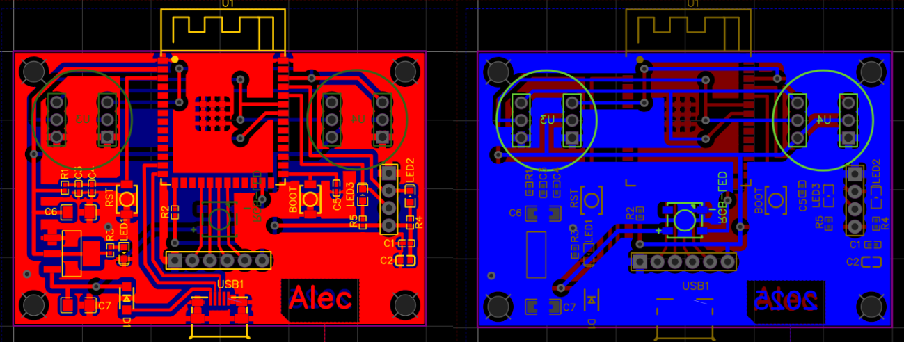

# Printed Circuit Board
English | [Русский](./README.ru.md)

> [!CAUTION]  
> There may be errors in the schematic or PCB layout. Before fabricating the PCB, we recommend consulting a professional! 

> [!WARNING]  
> Please read the [Known Issues](#-known-issues) section!

# Implementation Notes

## Components

The use of 0402 SMD components was chosen to reduce the cost of home PCB manufacturing. All passive components were desoldered from a widely available Chinese DevKit C-1 board (a clone of the original Espressif module). Other than that development board and two INMP441 microphones, no additional components are needed to build this PCB at home.

> [!NOTE]  
> The schematic and datasheet for the reference board version can be found in the repository:  
> [https://github.com/rtek1000/YD-ESP32-23.git](https://github.com/rtek1000/YD-ESP32-23.git)  
> This design served as a base for the microphone module.

## 🚨 Known Issues

The PCB layout does not fully follow the [Espressif guidelines for placing ESP32-S3-WROOM-1 modules](https://docs.espressif.com/projects/esp-hardware-design-guidelines/en/latest/esp32s3/pcb-layout-design.html#general-principles-of-pcb-layout-for-modules-positioning-a-module-on-a-base-board). As a result, the board exhibits degraded Wi-Fi signal quality. Ground planes, traces, and components located near the right side of the onboard antenna create parasitic structures and partially shield the signal.

### Possible Solutions:

- **Replace the module with [ESP32-S3-WROOM-1U](https://www.espressif.com/sites/default/files/documentation/esp32-s3-wroom-1_wroom-1u_datasheet_en.pdf)**, which supports external antennas. Plan antenna placement accordingly.
- **Redesign the PCB layout**: remove ground planes and traces in the antenna zone, or rework the component placement based on Espressif's recommendations.

> [!TIP]  
> Even with perfect layout, the onboard antenna is limited in performance. Therefore, **switching to the external-antenna variant (WROOM-1U) is the recommended approach**.

## PCB Schematic

## PCB Layout

## PCB Manufacturing Process

