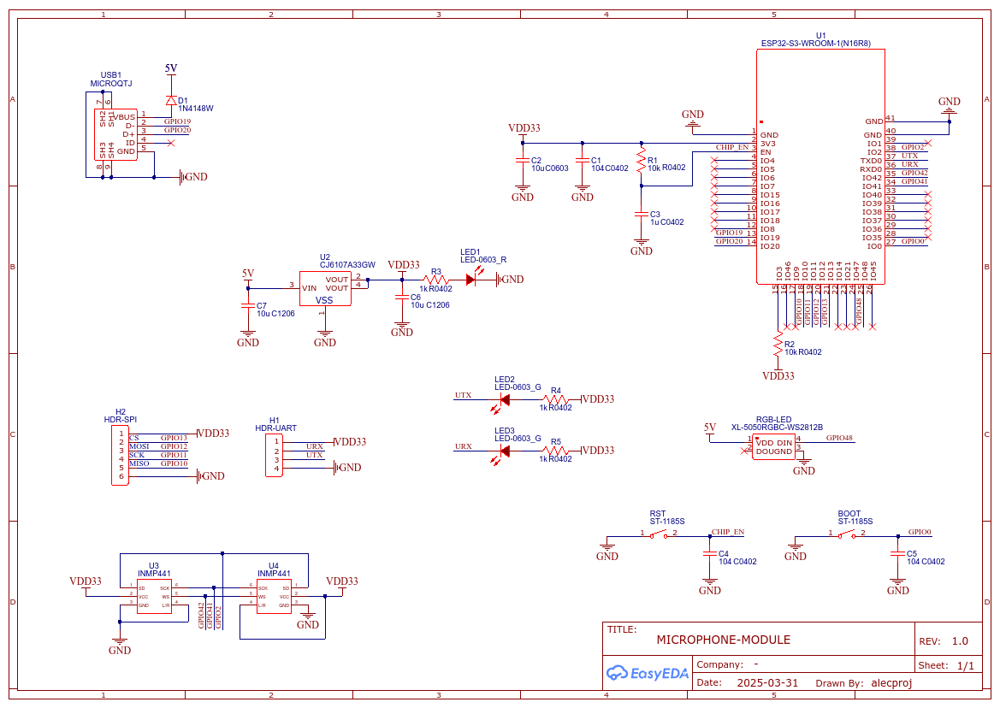
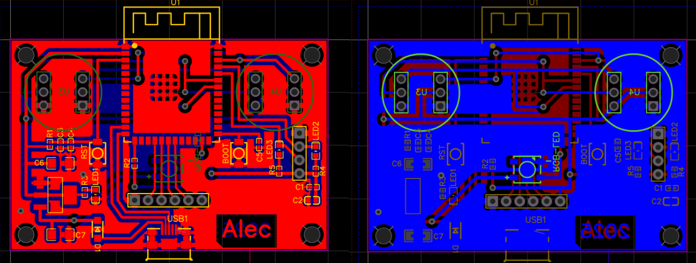

# Печатная плата
[English](./README.md) | Русский

> [!CAUTION]
> Схема и разводка печатной платы могут содержать ошибки. Перед воспроизведением печатной платы рекомендуется проконсультироваться с профессионалом!

> [!WARNING]
> Ознакомьтесь с содержимым раздела [Известные проблемы](#-известные-проблемы)!

# Заметки о реализации

## Компоненты

Выбор SMD-компонентов форм-фактора 0402 обусловлен стремлением удешевить производство печатной платы в домашних условиях. Все обвязочные компоненты были перепаяны с популярной на китайском рынке отладочной платы DevKit C-1 (клон оригинального модуля от Espressif). Помимо такой отладочной платы и двух микрофонов INMP441, для домашнего изготовления этой печатной платы дополнительных компонентов не потребуется.

>[!NOTE]
Схема и даташит к используемой версии платы размещены в репозитории:  
[https://github.com/rtek1000/YD-ESP32-23.git](https://github.com/rtek1000/YD-ESP32-23.git)  
Они были взяты за основу при разработке микрофонного модуля.
## 🚨 Известные проблемы

При разводке печатной платы не были учтены [рекомендации Espressif по размещению модулей ESP32-S3-WROOM-1](https://docs.espressif.com/projects/esp-hardware-design-guidelines/en/latest/esp32s3/pcb-layout-design.html#general-principles-of-pcb-layout-for-modules-positioning-a-module-on-a-base-board). В результате на разработанной плате наблюдаются проблемы с качеством Wi-Fi сигнала. Земляные полигоны, дорожки и компоненты, расположенные справа от антенны, создают паразитные антенны и частично экранируют сигнал.

### Возможные решения:

- **Заменить модуль на [ESP32-S3-WROOM-1U](https://www.espressif.com/sites/default/files/documentation/esp32-s3-wroom-1_wroom-1u_datasheet_en.pdf)** (с возможностью подключения выносной антенны) и продумать её размещение в корпусе.
- **Переработать топологию печатной платы**: удалить земляные полигоны и дорожки в зоне антенны, либо полностью изменить расположение компонентов в соответствии с рекомендациями Espressif.

> [!TIP] 
> Учитывая ограниченные возможности встроенной антенны даже при идеальной разводке, **наиболее предпочтительным вариантом является переход на модуль с внешней антенной (WROOM-1U)**.

## Схема печатной платы

## Разводка печатной платы

## Процесс изготовления печатной платы

